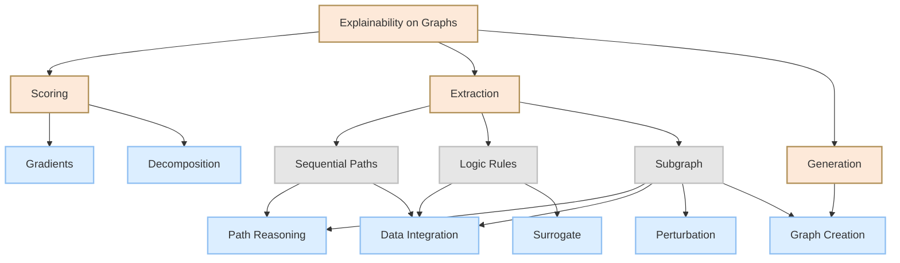

# Graph-Based Explainable AI: A Comprehensive Survey

[code](https://github.com/Buguemar/graphing-a-decision)

## 0. Overview

```mermaid
graph TD
    style A fill:#FDE9D9,stroke:#B2925A,stroke-width:2px
    style B fill:#FDE9D9,stroke:#B2925A,stroke-width:2px
    style C fill:#FDE9D9,stroke:#B2925A,stroke-width:2px
    style D fill:#FDE9D9,stroke:#B2925A,stroke-width:2px

    style E fill:#DCEEFF,stroke:#91C0F2,stroke-width:2px
    style F fill:#DCEEFF,stroke:#91C0F2,stroke-width:2px
    style G fill:#E6E6E6,stroke:#BFBFBF,stroke-width:2px
    style H fill:#E6E6E6,stroke:#BFBFBF,stroke-width:2px
    style I fill:#E6E6E6,stroke:#BFBFBF,stroke-width:2px

    style J fill:#DCEEFF,stroke:#91C0F2,stroke-width:2px
    style K fill:#DCEEFF,stroke:#91C0F2,stroke-width:2px
    style L fill:#DCEEFF,stroke:#91C0F2,stroke-width:2px
    
    A[Explainability on Graphs]
    B[Scoring] --> E[Gradients]
    B[Scoring] --> F[Decomposition]

    A --> B[Scoring]
    A --> C[Extraction]
    A --> D[Generation]

    C[Extraction] --> G[Sequential Paths]
    C[Extraction] --> H[Logic Rules]
    C[Extraction] --> I[Subgraph]

    G[Sequential Paths] --> J[Path Reasoning]
    H[Logic Rules] --> K[Data Integration]
    G --> K
    H[Logic Rules] --> L[Surrogate]
    I[Subgraph] -->J
    I[Subgraph] -->K
    I[Subgraph] --> M[Perturbation]
    I[Subgraph] --> N[Graph Creation]

    D --> N

    style M fill:#DCEEFF,stroke:#91C0F2,stroke-width:2px
    style N fill:#DCEEFF,stroke:#91C0F2,stroke-width:2px
```
